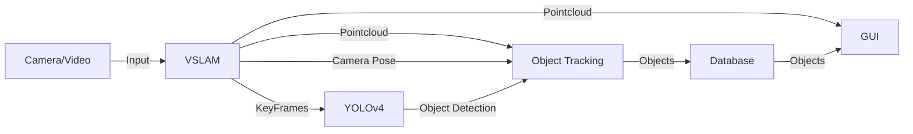

# Documentation

**Nafis Abeer**: nafis@bu.edu

**Rohan Kumar**: roku@bu.edu

**Zane Mroue**: zanem@bu.edu

**Samuel Gulinello**: samgul@bu.edu

**Sanford Edelist**: edelist@bu.edu

### Description

Visual Simultaneous Localization and Mapping (VSLAM) is the process of taking camera feed, as well as its position, and building a map of the current local world, specifically using visual input. This project uses this process, and builds upon it by also tracking objects within a frame. In this comes two problems: object detection, and then subsequent mapping and tracking of objects within a 3D space. For our final product we settle on RGBD VSLAM implementation. Our goal was to detect objects in the keyframes used for the SLAM algorithm and pinpoint the exact location of the objects in a 3D map. This could see applications in warehouse environments where owners would want to track exact locations of their inventory.

### Background on RGBD VSLAM

RGBD VSLAM (Red-Green-Blue-Depth Visual Simultaneous Localization and Mapping) combines RGB color information with depth data obtained from RGBD sensors to create a detailed 3D map of an environment. This technology not only captures the appearance of the scene using the RGB channels but also measures the distance to various objects within the scene using the depth channel. This depth data is crucial for accurately positioning objects in three dimensions and improving the robustness of the mapping process.

In RGBD VSLAM, the system processes sequences of RGBD frames to detect and match features across these frames. The matching features, along with the depth information, are used to estimate the camera's motion and reconstruct a structured 3D world model. This model is continuously updated as new data comes in, allowing the system to not only navigate through but also interact with its environment in a meaningful way. RGBD VSLAM is particularly effective in indoor environments where precise depth information helps in navigating tight spaces and around obstacles with high accuracy. The added benefit of using RGBD input sources to perform SLAM is that we are able to recreate a multicolor dense-color map of the entire scene from the results of the VSLAM algorith. This dense reconstructed map of the scenario aids our object tracking algorithm. 

### Implementation

For simplicity, the general system framework is shown below:

- **Camera/Video**: We use prerecorded videos as our examples and tests. We use two datasets, both augmented with depth perception data, which allows us to reconstruct a dense map for the scene captured from the footage. We also have a mechanism of collecting a monocular video feed (either from a drone or from regular phone camera) and we have Java scripts to break the footage into frames, which we can then perform monocular VSLAM on. Note that monocular VSLAM is not as effective as RGBD VSLAM, as we are unable to recreate the dense color map of the scene, therefore, we limit our functionality with this data source to simply demonstrating our ability to perform VSLAM on footage collected from an arbitrary camera source. 

- **VSLAM**: using the MATLAB VSLAM algorithm, this process takes the raw frame and does two things: finds "features", or important points used for tracking, and finds "keyframes", which are a subset of the entire set of frames that capture the most information about the video (i.e. movement gives points their 3D position). The full detail of our vslam_implemenation script for rgbd sources is provided below:

    - Data Preparation: The script begins by ensuring the dataset is correctly configured, downloading and extracting data if necessary, and organizing RGB and depth image data stores for processing.
    - Map Initialization: It initializes the 3D map using the first frame of the dataset, extracting features and their corresponding 3D world points. This foundational step establishes the base for tracking and map updates.
    - Feature Detection and Matching: As the sequence progresses, the script continuously detects and matches ORB features across new frames to those in the last key frame. This information is crucial for tracking camera movement and identifying significant frames (keyframes).
    - Pose Estimation and Refinement: By estimating the camera pose with a Perspective-n-Point algorithm and refining it through bundle adjustments, the script maintains a high accuracy in the 3D map's structure and the camera's location within it.
    - Key Frame Determination: Not every frame is equally valuable for 3D mapping; thus, the script strategically selects key frames based on specific criteria, such as the number of tracked features and the interval since the last key frame. This selection helps optimize processing and storage requirements.
    - Local and Global Map Updates: The script dynamically updates the map with new 3D points and refines existing ones, ensuring the map remains robust as new data is incorporated. This includes culling outlier points and updating map points after global pose optimization.
    - Loop Closure Detection: To correct any cumulative errors in the map and trajectory, the script implements loop closure detection. This process identifies when the camera revisits a previously mapped area, allowing the system to adjust for any drift that occurred since the initial mapping.
    - Output Management: Finally, the script generates several outputs, including optimized camera poses, 3D point clouds, and intrinsic camera parameters. These outputs are meticulously saved into structured directories for further analysis and visualization, reflecting the comprehensive nature of our VSLAM system.

- **YOLOv4**: The YOLOv4 model deployed in our project represents a major advancement in object detection technology. By using a convolutional neural network (CNN), YOLOv4 processes entire images in a single evaluation, predicting both bounding boxes and class probabilities directly from full images. This process makes YOLOv4 exceptionally fast and accurate, suitable for real-time applications.

    Script Functionality:
    - Setup and Initialization: Our script initializes YOLONet, configuring it with necessary parameters such as configuration files, weights, and object class names. 
    - Image Processing Loop: The script processes each image from the designated directory of keyframes. For each image, it performs object detection using YOLOv4, which includes loading the image, executing the detection, and recording the time taken for these operations.
    - Bounding Box and Metadata Output: Detected objects are marked with bounding boxes, and corresponding metadata (class, confidence level, and bounding box dimensions) is saved both visually on the image and textually in CSV files. This dual recording facilitates further analysis and visualization of detection results.
    - Performance Metrics: The script tracks the duration taken to process each frame and computes overall metrics such as total processing time and average time per frame. These metrics are crucial for evaluating the efficiency of the object detection process across the entire dataset.

- **Object Tracking**: the significant contribution using data structures and algorithms, this system takes the bounding boxes of each object (in 2D on a single frame), and the features (in 3D on the same frame), finds each feature in each bounding box, and then tries to rectify the objects in the current frame with objects found in past frames. We solve this by implementing a data structure called an [ObjectSet](./src/main/java/object_detection/ObjectSet.java). For each object that has already been found, we compare a new object, and if there is some percentage of similarity in features contained in both objects, we combine these two objects and update the database correspondingly.
    - there is further explanation and runtime analysis in the Appendix A
    - the output is an iteratively more accurate set of objects that correspond to reality

- **Database**: for ease of retrieving, updating, and storing Objects and corresponding features, we use a MongoDB database
    - the output is storage for those objects from object tracking

    #### MongoDBInteraction
    - **MongoDB Connection**: Connects to a MongoDB cluster using a secure URI, targeting a specific database and collection for object storage.
    - **Data Retrieval**: Implements methods to fetch the latest set of objects from the database and convert them from MongoDB documents to Java objects.
    - **Data Update**: Provides functionality to update or insert new object sets into the database using MongoDB's upsert feature.
    - **Serialization**: Handles the conversion of complex Java objects to MongoDB documents suitable for storage.
    #### BackendJava (Spring Boot Application)
    - **Spring Boot Setup**: Configures and launches a Spring Boot application, defining RESTful endpoints.
    - **REST API Controllers**: Defines multiple endpoints to interact with the MongoDB database and return object sets in JSON format. Includes error handling and response customization.
    - **Process Control**: Includes endpoints to initiate processing tasks and respond with process results.
    #### WebMvcConfig
    - **CORS Configuration**: Sets up CORS policy allowing unrestricted access from specified origins, facilitating cross-origin requests during development.
    #### ObjectSetController (part of BackendJava.java)
    - **Endpoint Configuration**: Manages API endpoints for retrieving and manipulating object data, structured in JSON format for ease of use in client applications.
    #### BackendService (part of BackendJava.java)
    - **Service Endpoints**: Offers utility endpoints for basic web interactions and processes related to object detection.
    - **Static Content Management**: Serves static resources like HTML, CSS, and JavaScript files, facilitating frontend interactions.

- **GUI**: for an outward facing display of our work, we implemented a Javascript UI, that creates a server, such that we can view the system's output in any browser.
    - the output guides the user through the process of making the application as well as provides a conceise view of the data produced by the server side code.
    - A colored point cloud is generated in the front end from the raw data sent by the back end. This is done by a library called plotly by converting the color and position values of each point to dots on the 3d point cloud.
    - Each item is represented on the front end as a button to select an item in the point cloud. When the user selects that item the 3d visualization highlights the corresponding points.

### Features

- [10%] Object Recognition: using YOLOv4, we used the weights from the model, and created a YoloNet, which is trained as a convolutional neural network that detects objects within a 2D image.
- [30%] Performance Optimization: we developed the ObjectSet data structure, that iterates over the frames of a video, and on each frame, incorporates more information. The ObjectSet holds a list of PointSets, and each PointSet represents a collection of 3D points that constitute an object within the real world. 
    - For optimization, we turned the list of points in each PointSet into a HashSet, implementing an equals() and hashcode() method for the Point class. This substantially improved performance.
- [15%] Integration with EuRoC MAV and other Datasets: 
    - We integrated the system with two datasets, the tum_rgbd and the imperial_london subdirectories within the codebase. However, with the current system, the only addition necessary would be to give the VSLAM algorithm any RGBD (RGB + depth) video. Given that video, VSLAM should build all data we need, and then we can perform object detection and tracking.
- [30%] Object Tracking: object tracking occurs when we iterate over each KeyFrame, placing objects into the objectset. At each iteration, we find new candidate objects from the new frame, and iteratively check if these new objects are instances of previously found PointSets, or previously undiscovered objects within the real world. 
- [15%] Comprehensive Benchmark: 
    - See benchmark section below
- [10%] Server and Database: we implemented the server with Spring-Boot, and wrote a GUI in JavaScript/CSS/HTML that is served by a Java backend. This makes it easy to view the pointcloud view of the room, and choose objects to be highlighted on the display.
- [10%] The original Tello drone integration failed due to contraints of our drone itself. We are able to demonstrate performing VSLAM on footage collected from our phone isntead

### Benchmarking and Time Complexity Analysis

Benchmarking Time Analysis:

Processing time for single frame:

158,000 points: avg 17ms, max 57ms, min 4ms

83,000 points: avg 9ms, max 33ms, min 2ms

49,000 points: avg 6ms, max 25ms, min 1ms

22,000 points: avg 2ms, max 16ms, min under 1ms

It should be noted that before implementation optimization on the PointSet class (changing from a list to a hashset), the system could significantly longer (on the magnitude of minutes). Now, the full system takes less than 2 seconds to process an 87 KeyFrame video. 

Yolo detector average execution time per frame: 915 ms. 

### Time Complexity

The object detection can be split into several parts:
1. **Downsampling**: from a video, a massive pointcloud is created. For example, an 87 keyframe video produces around 4,000,000 points. We perform downsampling to lower the amount of points used in our analysis, which saves on time.
    - this is performed by voxel bucketing: the process basically creates buckets in a 3D grid, and places each point in the pointcloud into its corresponding bucket (according to its x,y,z coordinate). Then, we average out all points within each bucket, and return all buckets (now called voxels), with more than 1 point in it.
    - this is linear on points, since for each point, finding the bucket can be done in O(1) time with the bucket grid implemented as a 3D array.
    - FINAL RUNTIME: **O(P)** for P initial points
2. **Point Projection**: we iterate through each frame, and project all points in the now downsampled pointcloud onto that frame. This uses a complicated 3D projection algorithm that uses linear algebra and the Camera Pose (its location and orientation) to find the 2D frame coordinate of each point.
    - this is linear on the number of points in the pointcloud, since we only perform constant time operations, and all matrix multiplications use matrices of known size (3 or 4 rows/columns), so these operations are also constant
    - FINAL RUNTIME: **O(PF)** for P points and F frames
3. **Bounding Box Point Collection**: the next step is finding whether each point (now projected onto the 2D frame) falls into a specific bounding box (which represents a potential object). This is down, similar to downsampling, where we first create a 2D grid that represents the frame, and iterate through each bounding box, setting the value at the pixel locations of each bounding box to that bounding boxes' index in the list of bounding boxes. Then, we iterate through each point, check whether a bounding box has been set at that points pixel location, and if it is, we place that point into a new PointSet, which represents an object. 
    - the final product is a list of candidate PointSets (objects), each containing the points that were projected into each bounding box
    - although the number of bounding boxes is variable, since we know the size of the frame, this limits the number of bounding boxes to the number of pixels within the frame, which we know beforehand to be 480 and 640 (for the currently supported datasets). Therefore, the runtime is not dependent on the number of bounding boxes, but rather only on the number of points and frames
    - FINAL RUNTIME: **O(PF)** for P points and F frames
4. **Object Reconciliation**: the final step in the process is checking each candidate object against previous objects stored within the database. For each candidate object recovered within a frame, we iterate through each previously known object in the ObjectSet list, and iterate through each point in the candidate PointSet, keeping a count of how many points are found to be equal. If the number of points passes some heuristically-set percentage of the previously known object's size, we intersect the two PointSets. If not, we add the candidate PointSet to the list of objects.
    - for a single frame, we might have N objects in the ObjectSet already. Then, for the current PointSet, we iterate through each of those N objects, and check each of the points in the candidate. This check takes O(1) for each point, since we implement the PointSets as a hashset.
    - in the worst case, we still have a constant number of objects for each frame, due to the limit on the frame size in pixels. So, we know that the number of points we end up checking proportional to F^2 for F frames
    - FINAL RUNTIME: **O(PF^2)**, for P points and F frames

In total, we are bounded by O(PF^2) for P points and F frames. It should be noted that P will almost always be greater than F^2 in a real life situation due to the magnitude of points that are collected for each frame.

# Code

The following links:
- [The branch and directory containing Java 17 Code to be executed](./../../tree/master/src/main/java)
- [The data needed for the examples used for this system](./../../tree/master/src/main/java/vslam/[tum_rgb/imperial_london])
- [The testing code for this system](./../../tree/master/src/test/java/)

# Work Breakdown

**Nafis Abeer**:
- Initial project management and task division
- Dataset aquisition (initial research)
- VSLAM Implementation (RGBD and monocular): aquired data necessary for object tracking algorithm
- YOLOv4 Implementation (creating bounding box meta data)
- VSLAM on footage collected from phone data, splitting up footage into frames using our maven architecture
- Handling reports on issues from peer review and worked with all teeammates to compile final report

**Rohan Kumar**:
- Serverside managment (oversaw connection of various features)
- Object set classes and bounding box classes (all classes related to points)
- All object tracking algorithms. Responsible for accurately localizing objects within 3D environment. Benchmarked and explained its complexities as well.
- Debugged majority of code during Integration.
- Built Maven system for building and running tests and server/frontend
- Also worked on cleaning up front end
- Half of final report

**Zane Mroue**:
- Database management (MongoDB)
- Springboot server (connection to frontend)
- Server Integration
- Data retrieval for database
- Objectset updates to database and efficient data storage

**Samuel Gulinello**:
- GUI Creation
- All JavaScript, HTML, CSS files
- Utilized and Configured 3d plotting libraries for pointcloud
- Worked on server configuration
- Cleaned up frontend and worked with Rohan to update front end with fixed object tracker

**Sanford Edelist**:
- Built unit tests for Object Detection
- Built unit tests for YOLO
- Debugged unit tests
- Modified bounding box collection to also collect class results from YOLO detector

### Accepted feedback:
- "Enhancement in the visual interface" by Manuel Segimon
    - "I suggest a potential enhancement in the visual interface. Instead of adding a new object below the current one, consider a design that deletes the current one and adds a new one. This way, the page doesn’t get bigger the more objects you look at, improving the user experience."
        - Our front end now should be able to do just that

- "Confusing object selection in browser" by Seyed Reza Sajjadinasab
    - "It is not clear what are the different 0-14 objects. Selecting between them didn't result in any change in the output."
        - We are adding class display for object numbers to the front end

- "install.txt is misleading" by Seyed Reza Sajjadinasab
    - "It is said that the instruction provided is for "A Unix/Linux-based operating system", however, the installation source is a java library from a location in the lab machines. Using it on another Linux system will change "~/.bashrc" and cause problems for further usage of the OS.
    The received error:
    -bash: /ad/eng/opt/java/add_jdk17.sh: No such file or directory"
        - This should be addressed now in the install.txt

- "Ask user what type of object to detect" by Seyed Reza Sajjadinasab
    - "You can specify a few types of objects that are detectable. It is not clear now what type of object is detected running mvn exec:java -Dexec.mainClass="yolo.YOLOTest" -Dexec.classpathScope="test". For example, why books are not detected as objects?" 
        - The class names next to object names should clear this up

### Rejected feedback:
- "Web Interface improvement" by Tejas Thakur Singh
    - "Add tabs or a compact grid view in order to fix the organization issues that come with having multiple views open"
        - Sort of addressed already by Manuel's feedback

- "Java implementation of the GUI" by Seyed Reza Sajjadinasab
    - "It was required to do the majority of the project with Java. I think it's better to provide a Java version for the GUI as well instead of java script GUI."
        - We focused on functionality of the GUI for the purposes of our 3D localization, and javascript is better suited with the necessary libraries to perform this task

- "Showing the original video/picture" by Seyed Reza Sajjadinasab
    - "The original video can be shown in the browser to make it easier to identify the significance of the tool and the process."
        - Our reconstructed dense object map will take this into account. Furthermore, we are going to show the original scenario(s) the VSLAM is performed on during our demo. The final output on the front end is color mapped, so the objects are reletively visible in a 3D display of the scene

- "Window size not adjusted" by Seyed Reza Sajjadinasab
    - "The size of the window is not adjusted while using a browser to view the result."
        - This seemed to be a sececondary issue to our main goal for the project

- "Command line user interface for image and video" by Seyed Reza Sajjadinasab
    - "It will be good if the user can pass the filename to the tool and it does the detection on the specified file."
        - We have scripts available to perform this task on the backend, and we provide 2 RGBD datasets where users can perform VSLAM on for our functional front end. We also provide video captured using a monocular camera source that we can perform VSLAM on, but this dataset is not displayed in the front end due to our algorithms incompatibility with depth-less data

### Additional changes
- Improved object tracking algorithm
- Improved VSLAM by incorportaing VSLAM RGBD
- Ability to perform monocularr VSLAM on footage collected from arbitrary data source

# Appendix

### A: References and Material Used

- The UI used a Library called [Plotly](https://plotly.com). This library is responsible for creating the visualization of the pointcloud. 
- The object detection uses [YOLOv4](https://github.com/bytedeco/javacv/blob/master/samples/YOLONet.java) from the javacv library 
- The server was written with [Spring Boot](https://spring.io/projects/spring-boot) 
- The database used was via [MongoDB](https://www.mongodb.com/), and the database itself was hosted on MongoDB provided free-tier server
- The testing was done using [JUnit](https://junit.org/junit5/) 
- The mathworks Monocular VSLAM tutorial is used to guide our vslam_implemenation matlab script [VSLAM](https://www.mathworks.com/help/vision/ug/monocular-visual-simultaneous-localization-and-mapping.html)
- The mathworks RGBD VSLAM tutorial is used to guide our RGBD VSLAM implementation, augmented with a dense map [VSLAM](https://www.mathworks.com/help/vision/ug/visual-slam-with-an-rgbd-camera.html)
- TUM RGBD dataset: https://cvg.cit.tum.de/data/datasets/rgbd-dataset
- Imperial College London dataset: https://www.imperial.ac.uk/dyson-robotics-lab/downloads/ 

